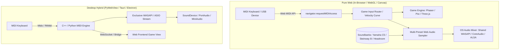

# MIDI & Web Audio Game Engine Implementation Guide

A complete technical blueprint for building web-based and desktop-hybrid games powered by physical MIDI keyboards. This document details sound sample sources, Web MIDI API integration, low-latency audio pipelines (Web Audio API, AudioWorklet, WASAPI/ASIO), velocity curve physics, multi-soundbank switching, and gameplay architecture.

---

## Table of Contents
1. [Architecture Overview: Web vs Desktop Hybrid](#1-architecture-overview-web-vs-desktop-hybrid)
2. [Audio Driver & Latency Pipelines](#2-audio-driver--latency-pipelines)
   - [A. Pure Browser: Web Audio API & AudioWorklet](#a-pure-browser-web-audio-api--audioworklet)
   - [B. Desktop Wrapper (WASAPI & ASIO via Python / Tauri / Electron)](#b-desktop-wrapper-wasapi--asio-via-python--tauri--electron)
3. [Sound Sample Libraries & Instrument Presets](#3-sound-sample-libraries--instrument-presets)
   - [A. Top 3 Authentic Acoustic Grand Pianos](#a-top-3-authentic-acoustic-grand-pianos)
   - [B. Soundbank Comparison & File Schemas](#b-soundbank-comparison--file-schemas)
   - [C. General MIDI (GM) Soundfonts (88+ Instruments)](#c-general-midi-gm-soundfonts-88-instruments)
   - [D. Web-Ready SFZ, SF2, & WebAssembly Synthesizers](#d-web-ready-sfz-sf2--webassembly-synthesizers)
   - [E. CDN Repositories & Direct Audio Endpoints](#e-cdn-repositories--direct-audio-endpoints)
4. [Multi-Instrument Soundbank Switcher Architecture](#4-multi-instrument-soundbank-switcher-architecture)
   - [A. Soundbank Registry & Dynamic Preloading](#a-soundbank-registry--dynamic-preloading)
   - [B. Switching Instruments on the Fly (Zero Dropout)](#b-switching-instruments-on-the-fly-zero-dropout)
5. [Web MIDI API Implementation](#5-web-midi-api-implementation)
   - [Connecting & Hot-Plugging Hardware](#connecting--hot-plugging-hardware)
   - [Parsing Raw MIDI Byte Streams](#parsing-raw-midi-byte-streams)
   - [Sustain Pedal (CC 64) & Pitch Bend Support](#sustain-pedal-cc-64--pitch-bend-support)
6. [Low-Latency Audio Engine Architecture](#6-low-latency-audio-engine-architecture)
   - [Multi-Sample Pitch Shifting & Velocity Layering](#multi-sample-pitch-shifting--velocity-layering)
   - [Envelope (ADSR) & Polyphony Voice Management](#envelope-adsr--polyphony-voice-management)
   - [AudioWorklet Custom DSP Node](#audioworklet-custom-dsp-node)
7. [Game Integration Architecture](#7-game-integration-architecture)
   - [Timing Windows & Rhythm Detection](#timing-windows--rhythm-detection)
   - [Input Buffer & Anti-Ghosting](#input-buffer--anti-ghosting)
   - [Multiplayer Network Synchronization](#multiplayer-network-synchronization)
8. [Complete Working Multi-Instrument Game Starter](#8-complete-working-multi-instrument-game-starter)

---

## 1. Architecture Overview: Web vs Desktop Hybrid

When building a game driven by MIDI hardware, there are two primary architectures:



### Which One Should You Choose?
- **Pure Web (Recommended for accessibility):** Zero installation required. Players connect their USB MIDI keyboard via Chrome, Edge, Brave, or Opera and play instantly. Latency is typically **8ms - 20ms** when using modern `AudioContext` + `AudioWorklet`.
- **Desktop Wrapper (Ultra-low latency competitive):** Uses **WASAPI Exclusive Mode** or **ASIO** on Windows to achieve **< 5ms** roundtrip latency and bypasses Windows OS audio mixing.

---

## 2. Audio Driver & Latency Pipelines

### A. Pure Browser: Web Audio API & AudioWorklet

Browsers handle audio hardware communication through the platform's native audio server:
- **Windows:** Browser automatically connects to **WASAPI Shared Mode** (Windows Audio Session API).
- **macOS / iOS:** Browser connects to **CoreAudio**.
- **Linux:** Browser connects to **PulseAudio / PipeWire / ALSA**.

#### Minimizing Latency in the Browser:
1. **Request `interactive` latency mode:**
   ```javascript
   const audioCtx = new (window.AudioContext || window.webkitAudioContext)({
     latencyHint: 'interactive', // Requests smallest hardware buffer from WASAPI / CoreAudio
     sampleRate: 48000           // Match default OS sample rate (usually 48000 or 44100)
   });
   ```
2. **Unlock AudioContext on First Interaction:**
   Browsers block audio autostart until user gesture:
   ```javascript
   window.addEventListener('pointerdown', async () => {
     if (audioCtx.state === 'suspended') {
       await audioCtx.resume();
     }
   }, { once: true });
   ```
3. **Use Web Workers / AudioWorklet for DSP & Note Scheduling:**
   Main thread garbage collection and rendering ticks can introduce jitter. `AudioWorkletGlobalScope` runs in a dedicated high-priority audio thread.

---

### B. Desktop Wrapper (WASAPI & ASIO via Python / Tauri / Electron)

If wrapping the game as a desktop app (using `pywebview`, `Electron`, or `Tauri`), you can hook directly into **Windows WASAPI Exclusive Mode** or **ASIO** drivers.

#### How WASAPI Exclusive Works:
- Standard Windows audio routes through the Windows Audio Engine Mixer (adds ~15-30ms buffer).
- **WASAPI Exclusive Mode** gives your application exclusive access to the hardware audio buffer endpoint, bypassing the OS mixer and reducing latency down to **3ms - 6ms**.

#### Python + SoundDevice / PortAudio Implementation:
```python
import sounddevice as sd
import numpy as np

# 1. Query WASAPI Host API
wasapi_api_index = None
for i, api in enumerate(sd.query_hostapis()):
    if 'WASAPI' in api['name']:
        wasapi_api_index = i
        break

# 2. Get low-latency WASAPI output device
wasapi_devices = [
    (idx, dev) for idx, dev in enumerate(sd.query_devices())
    if dev['hostapi'] == wasapi_api_index and dev['max_output_channels'] > 0
]

# 3. Create high-priority low-latency stream
wasapi_exclusive_settings = sd.WasapiSettings(exclusive=True)

stream = sd.OutputStream(
    samplerate=48000,
    blocksize=128,          # 128 samples @ 48kHz = 2.66ms buffer!
    device=wasapi_devices[0][0],
    channels=2,
    dtype='float32',
    extra_settings=wasapi_exclusive_settings,
    callback=audio_render_callback
)
stream.start()
```

---

## 3. Sound Sample Libraries & Instrument Presets

### A. Top 3 Authentic Acoustic Grand Pianos

You can provide players with multiple distinct piano instruments to switch between:

| Preset Name | Real-World Piano | Description & Sound Character | Repository & Samples |
|---|---|---|---|
| **Yamaha C5 (Salamander)** | Yamaha C5 Grand Piano | Bright, crisp, punchy attack, highly defined bass. Perfect for pop, anime, and fast rhythm games. | [sfzinstruments/SalamanderGrandPiano](https://github.com/sfzinstruments/SalamanderGrandPiano) |
| **Maestro Concert Grand** | Steinway Model B | Warm, rich, classical resonance, deep dynamic expression across 5 velocity layers. | [sfzinstruments/MatsHelgesson.MaestroConcertGrandPiano](https://github.com/sfzinstruments/MatsHelgesson.MaestroConcertGrandPiano) |
| **Headroom Piano** | Studio Grand (Close-Mic) | Intimate, dry, vintage acoustic tone. Excellent for lofi, jazz, indie soundtracks, and tight mixes. | [sfzinstruments/BengtNilsson.HeadroomPiano](https://github.com/sfzinstruments/BengtNilsson.HeadroomPiano) |

---

### B. Soundbank Comparison & File Schemas

#### 1. Yamaha C5 (Salamander Grand Piano)
- **Anchor Notes:** Minor thirds across 8 octaves (`C1, D#1, F#1, A1, C2, ... A7`)
- **Velocity Layers:** `v8` (Mezzo-forte) and `v14` (Fortissimo)
- **Naming Pattern:** `{Note}{Velocity}.flac` (e.g., `C4v8.flac`, `A3v14.flac`)
- **Raw Base URL:** `https://raw.githubusercontent.com/sfzinstruments/SalamanderGrandPiano/master/Samples/`

#### 2. Mats Helgesson Maestro Concert Grand (Steinway Model B)
- **Total Keys:** 88 individual keys (`021` to `108`)
- **Velocity Layers (5 dynamic levels):**
  - `p`: Piano (soft / delicate)
  - `mp`: Mezzo-piano
  - `mf`: Mezzo-forte
  - `f`: Forte (strong)
  - `ff`: Fortissimo (loudest strike)
- **Naming Pattern:** `mcg_{layer}_{midi:03d}.flac` (e.g., `mcg_mf_060.flac` for Middle C / MIDI 60)
- **Raw Base URL:** `https://raw.githubusercontent.com/sfzinstruments/MatsHelgesson.MaestroConcertGrandPiano/master/Samples/`

#### 3. Bengt Nilsson Headroom Piano
- **Anchor Notes:** Minor thirds (MIDI 21, 24, 27, 30, ..., 108)
- **Velocity Layers:** `LEVEL1`, `LEVEL2`, `LEVEL3`, `LEVEL4`, `LEVEL5`
- **Mic Perspectives:** `CLOSE` (Dry studio sound) and `PLAYER`
- **Naming Pattern:** `HEADROOM PIANO {LEVEL} CLOSE {midi}.flac` (e.g., `HEADROOM PIANO LEVEL2 CLOSE 60.flac`)
- **Raw Base URL:** `https://raw.githubusercontent.com/sfzinstruments/BengtNilsson.HeadroomPiano/master/Samples/`

---

### C. General MIDI (GM) Soundfonts (88+ Instruments)

If your game includes synthesizers, guitars, strings, or 8-bit chip instruments:

| SoundFont | Size | Formats | Link |
|---|---|---|---|
| **FluidR3_GM** | ~140MB (full), ~15MB (compressed) | SF2 / Soundfont JSON | [FluidR3 Repository](https://github.com/urish/soundfont-player) |
| **Musyng Kite** | ~30MB (high-res web) | MP3 / OGG base64 soundbanks | [gleitz/midi-js-soundfonts](https://github.com/gleitz/midi-js-soundfonts) |
| **FatBoy SoundFont** | ~20MB | GM SF2 soundfont for gaming | [FatBoy SoundFont](https://fatboy.site/) |
| **Arachno SoundFont** | ~140MB | High dynamic range symphonic GM | [Arachno Official](https://www.arachnosoft.com/main/soundfont.php) |

---

### D. Web-Ready SFZ, SF2, & WebAssembly Synthesizers

1. **`smplr` (Recommended for modern Web Audio)**
   - Built-in pitch shift and multi-velocity layering.
   - GitHub: `https://github.com/danigb/smplr`
   ```javascript
   import { Soundfont, SplendidGrandPiano } from 'smplr';
   const context = new AudioContext();
   const piano = new SplendidGrandPiano(context);
   piano.start({ note: 'C4', velocity: 90 });
   ```

2. **`spessasynth_lib` / `libfluidsynth.js` (WebAssembly SF2 Synthesizer)**
   - Runs FluidSynth via WASM in an AudioWorklet. Supports true multi-timbral MIDI playback and soundfonts (.sf2 / .sf3).
   - GitHub: `https://github.com/spessasus/spessasynth_lib`

---

### E. CDN Repositories & Direct Audio Endpoints

Directly streamable in web games without self-hosting:
```javascript
// Soundfont JSON / MP3 CDN:
const SOUNDFONT_CDN = "https://raw.githubusercontent.com/gleitz/midi-js-soundfonts/gh-pages/FluidR3_GM/";

// Salamander lightweight audio snippets:
const SALAMANDER_CDN = "https://tonejs.github.io/audio/salamander/";
```

---

## 4. Multi-Instrument Soundbank Switcher Architecture

### A. Soundbank Registry & Dynamic Preloading

To let players choose between soundbanks with instant switching and RAM caching:

```javascript
/**
 * Soundbank Registry Definition
 */
const SOUNDBANK_CONFIGS = {
  salamander: {
    id: 'salamander',
    name: 'Yamaha C5 Grand (Salamander)',
    baseUrl: 'https://raw.githubusercontent.com/sfzinstruments/SalamanderGrandPiano/master/Samples/',
    anchors: [21, 24, 27, 30, 33, 36, 39, 42, 45, 48, 51, 54, 57, 60, 63, 66, 69, 72, 75, 78, 81, 84, 87, 90, 93, 96, 99, 102, 105, 108],
    getFileName: (midi, isForte) => {
      const noteNames = ['C', 'C#', 'D', 'D#', 'E', 'F', 'F#', 'G', 'G#', 'A', 'A#', 'B'];
      const octave = Math.floor(midi / 12) - 1;
      const noteStr = noteNames[midi % 12] + octave;
      const vel = isForte ? 'v14' : 'v8';
      return `${noteStr}${vel}.flac`;
    }
  },
  maestro: {
    id: 'maestro',
    name: 'Steinway Model B (Maestro Concert Grand)',
    baseUrl: 'https://raw.githubusercontent.com/sfzinstruments/MatsHelgesson.MaestroConcertGrandPiano/master/Samples/',
    anchors: [21, 24, 27, 30, 33, 36, 39, 42, 45, 48, 51, 54, 57, 60, 63, 66, 69, 72, 75, 78, 81, 84, 87, 90, 93, 96, 99, 102, 105, 108],
    getFileName: (midi, isForte) => {
      const layer = isForte ? 'f' : 'mf';
      const paddedMidi = String(midi).padStart(3, '0');
      return `mcg_${layer}_${paddedMidi}.flac`;
    }
  },
  headroom: {
    id: 'headroom',
    name: 'Headroom Studio Piano (Close-Mic)',
    baseUrl: 'https://raw.githubusercontent.com/sfzinstruments/BengtNilsson.HeadroomPiano/master/Samples/',
    anchors: [21, 24, 27, 30, 33, 36, 39, 42, 45, 48, 51, 54, 57, 60, 63, 66, 69, 72, 75, 78, 81, 84, 87, 90, 93, 96, 99, 102, 105, 108],
    getFileName: (midi, isForte) => {
      const level = isForte ? 'LEVEL4' : 'LEVEL2';
      return encodeURIComponent(`HEADROOM PIANO ${level} CLOSE ${midi}.flac`);
    }
  }
};
```

---

### B. Switching Instruments on the Fly (Zero Dropout)

```javascript
class MultiPresetPianoEngine {
  constructor(audioCtx) {
    this.ctx = audioCtx;
    this.currentPresetId = 'salamander';
    this.soundbankCache = new Map(); // presetId -> Map(anchorMidi -> AudioBuffer)
    this.activeVoices = new Map();   // midiNote -> Voice[]
    this.sustainPedal = false;
    this.sustainedNotes = new Set();
    this.loading = false;
  }

  async loadPreset(presetId, onProgress) {
    if (this.soundbankCache.has(presetId)) {
      this.currentPresetId = presetId;
      return;
    }

    const config = SOUNDBANK_CONFIGS[presetId];
    if (!config) throw new Error(`Unknown preset: ${presetId}`);

    this.loading = true;
    const presetMap = new Map();
    const total = config.anchors.length;
    let count = 0;

    // Concurrently load anchor samples
    await Promise.all(config.anchors.map(async (midi) => {
      const fileName = config.getFileName(midi, true); // Load forte layer
      const url = config.baseUrl + fileName;
      try {
        const resp = await fetch(url);
        const arrayBuf = await resp.arrayBuffer();
        const audioBuf = await this.ctx.decodeAudioData(arrayBuf);
        presetMap.set(midi, audioBuf);
      } catch (e) {
        console.warn(`Failed to load ${fileName}:`, e);
      }
      count++;
      if (onProgress) onProgress(count / total);
    }));

    this.soundbankCache.set(presetId, presetMap);
    this.currentPresetId = presetId;
    this.loading = false;
  }

  // Switch soundbank instantly without audio clipping
  setPreset(presetId) {
    // Release any currently ringing notes smoothly
    for (let note of this.activeVoices.keys()) {
      this.noteOff(note, true);
    }
    this.currentPresetId = presetId;
  }

  findNearestAnchor(note) {
    const activeMap = this.soundbankCache.get(this.currentPresetId);
    if (!activeMap) return 60;
    let nearest = 60;
    let minDiff = Infinity;
    for (let anchor of activeMap.keys()) {
      const diff = Math.abs(note - anchor);
      if (diff < minDiff) {
        minDiff = diff;
        nearest = anchor;
      }
    }
    return nearest;
  }

  noteOn(note, velocity = 100) {
    if (this.ctx.state === 'suspended') this.ctx.resume();
    this.noteOff(note, true);

    const activeMap = this.soundbankCache.get(this.currentPresetId);
    if (!activeMap) return;

    const anchor = this.findNearestAnchor(note);
    const buffer = activeMap.get(anchor);
    if (!buffer) return;

    // Pitch shift by semitones difference
    const semitoneDiff = note - anchor;
    const playbackRate = Math.pow(2, semitoneDiff / 12);

    const source = this.ctx.createBufferSource();
    source.buffer = buffer;
    source.playbackRate.value = playbackRate;

    // Velocity Curve Calculation (Square Root Curve)
    const normVel = Math.max(0.01, Math.min(1.0, velocity / 127.0));
    const gainVal = Math.sqrt(normVel);

    const gainNode = this.ctx.createGain();
    const now = this.ctx.currentTime;
    gainNode.gain.setValueAtTime(0, now);
    gainNode.gain.linearRampToValueAtTime(gainVal, now + 0.003); // 3ms anti-click fade

    source.connect(gainNode);
    gainNode.connect(this.ctx.destination);
    source.start(now);

    const voice = { source, gainNode, note, startTime: now };
    if (!this.activeVoices.has(note)) this.activeVoices.set(note, []);
    this.activeVoices.get(note).push(voice);
  }

  noteOff(note, force = false) {
    if (this.sustainPedal && !force) {
      this.sustainedNotes.add(note);
      return;
    }
    const voices = this.activeVoices.get(note);
    if (!voices) return;

    const now = this.ctx.currentTime;
    voices.forEach(voice => {
      voice.gainNode.gain.cancelScheduledValues(now);
      voice.gainNode.gain.setValueAtTime(voice.gainNode.gain.value, now);
      voice.gainNode.gain.exponentialRampToValueAtTime(0.0001, now + 0.12);
      voice.source.stop(now + 0.13);
    });
    this.activeVoices.delete(note);
    this.sustainedNotes.delete(note);
  }

  setSustainPedal(isDown) {
    this.sustainPedal = isDown;
    if (!isDown) {
      for (const note of this.sustainedNotes) {
        this.noteOff(note, true);
      }
      this.sustainedNotes.clear();
    }
  }
}
```

---

## 5. Web MIDI API Implementation

### Connecting & Hot-Plugging Hardware

```javascript
class MidiController {
  constructor(onNoteOn, onNoteOff, onControlChange) {
    this.onNoteOn = onNoteOn;
    this.onNoteOff = onNoteOff;
    this.onControlChange = onControlChange;
    this.midiAccess = null;
    this.activeInputs = new Map();
  }

  async init() {
    if (!navigator.requestMIDIAccess) {
      throw new Error('Web MIDI API is not supported in this browser.');
    }

    try {
      this.midiAccess = await navigator.requestMIDIAccess({ sysex: false });
      this.midiAccess.onstatechange = (e) => this.handleStateChange(e);

      for (let input of this.midiAccess.inputs.values()) {
        this.attachInput(input);
      }
      return true;
    } catch (err) {
      console.error('Failed to get MIDI access:', err);
      return false;
    }
  }

  attachInput(input) {
    if (!this.activeInputs.has(input.id)) {
      input.onmidimessage = (msg) => this.handleMidiMessage(msg);
      this.activeInputs.set(input.id, input);
      console.log(`MIDI Connected: ${input.name} [${input.manufacturer}]`);
    }
  }

  handleStateChange(event) {
    const port = event.port;
    if (port.type === 'input') {
      if (port.state === 'connected') {
        this.attachInput(port);
      } else if (port.state === 'disconnected') {
        this.activeInputs.delete(port.id);
        console.log(`MIDI Disconnected: ${port.name}`);
      }
    }
  }

  handleMidiMessage(event) {
    const [status, data1, data2] = event.data;
    const command = status >> 4;
    const channel = status & 0x0F;

    switch (command) {
      case 0x9: // Note On
        if (data2 > 0) {
          this.onNoteOn(data1, data2, channel, event.timeStamp);
        } else {
          this.onNoteOff(data1, channel, event.timeStamp);
        }
        break;

      case 0x8: // Note Off
        this.onNoteOff(data1, channel, event.timeStamp);
        break;

      case 0xB: // Control Change (CC 64 = Sustain Pedal)
        if (data1 === 64) {
          this.onControlChange('sustain', data2 >= 64);
        }
        break;
    }
  }
}
```

---

## 6. Low-Latency Audio Engine Architecture

### AudioWorklet Custom DSP Node

For zero main-thread audio blocking and custom synthesizers:

```javascript
// audio-processor.js (AudioWorklet thread)
class MidiSynthProcessor extends AudioWorkletProcessor {
  constructor() {
    super();
    this.port.onmessage = (e) => this.handleMessage(e.data);
  }

  handleMessage(msg) {
    // Process Note On / Note Off events directly inside the audio thread
  }

  process(inputs, outputs, parameters) {
    const output = outputs[0];
    // Fill output channel buffers with synthesized or sampled PCM audio
    return true;
  }
}
registerProcessor('midi-synth-processor', MidiSynthProcessor);
```

---

## 7. Game Integration Architecture

### Timing Windows & Rhythm Detection

```javascript
class RhythmJudgementEngine {
  constructor() {
    this.JUDGEMENT_WINDOWS = {
      PERFECT: 25,  // ±25ms
      GREAT:   50,  // ±50ms
      GOOD:    100, // ±100ms
      MISS:    160  // > 160ms
    };
  }

  judgeKeystroke(targetNoteTimeMs, actualHitTimeMs, playedNote, targetNote) {
    if (playedNote !== targetNote) {
      return { score: 0, rating: 'WRONG_KEY' };
    }

    const deltaMs = Math.abs(actualHitTimeMs - targetNoteTimeMs);

    if (deltaMs <= this.JUDGEMENT_WINDOWS.PERFECT) {
      return { score: 100, rating: 'PERFECT', delta: actualHitTimeMs - targetNoteTimeMs };
    } else if (deltaMs <= this.JUDGEMENT_WINDOWS.GREAT) {
      return { score: 75, rating: 'GREAT', delta: actualHitTimeMs - targetNoteTimeMs };
    } else if (deltaMs <= this.JUDGEMENT_WINDOWS.GOOD) {
      return { score: 50, rating: 'GOOD', delta: actualHitTimeMs - targetNoteTimeMs };
    } else {
      return { score: 0, rating: 'MISS', delta: actualHitTimeMs - targetNoteTimeMs };
    }
  }
}
```

---

## 8. Complete Working Multi-Instrument Game Starter

A standalone HTML/JS game sandbox featuring live MIDI keyboard input, real-time soundbank switching, and visual keystroke feedback:

```html
<!DOCTYPE html>
<html lang="en">
<head>
  <meta charset="UTF-8">
  <title>MIDI Multi-Instrument Web Game</title>
  <style>
    body {
      background: #0d1117;
      color: #e6edf3;
      font-family: -apple-system, BlinkMacSystemFont, "Segoe UI", Roboto, sans-serif;
      display: flex;
      flex-direction: column;
      align-items: center;
      padding: 2rem;
    }
    .panel {
      background: #161b22;
      border: 1px solid #30363d;
      border-radius: 12px;
      padding: 1.5rem;
      width: 100%;
      max-width: 600px;
      box-shadow: 0 8px 24px rgba(0,0,0,0.5);
    }
    .select-box {
      width: 100%;
      padding: 10px;
      background: #21262d;
      border: 1px solid #30363d;
      color: #fff;
      font-size: 1rem;
      border-radius: 6px;
      margin-top: 8px;
    }
    .key-display {
      font-size: 2.5rem;
      font-weight: bold;
      color: #58a6ff;
      text-align: center;
      margin: 1.5rem 0;
      height: 60px;
    }
    .status-badge {
      display: inline-block;
      padding: 4px 12px;
      border-radius: 20px;
      font-size: 0.85rem;
      font-weight: 600;
      background: #238636;
      color: #fff;
    }
    .progress-bar {
      height: 6px;
      background: #21262d;
      border-radius: 3px;
      overflow: hidden;
      margin-top: 10px;
    }
    .progress-fill {
      height: 100%;
      width: 0%;
      background: #58a6ff;
      transition: width 0.2s ease;
    }
  </style>
</head>
<body>
  <div class="panel">
    <h2>🎹 MIDI Web Game Sandbox</h2>
    <p>Connect your USB MIDI Keyboard and play.</p>

    <label><strong>Select Piano Soundbank:</strong></label>
    <select id="presetSelect" class="select-box">
      <option value="salamander">Yamaha C5 Grand (Salamander)</option>
      <option value="maestro">Steinway Model B (Maestro Concert Grand)</option>
      <option value="headroom">Headroom Studio Grand (Bengt Nilsson)</option>
    </select>

    <div class="progress-bar">
      <div id="progressFill" class="progress-fill"></div>
    </div>

    <div class="key-display" id="keyDisplay">Press any MIDI Key</div>

    <div>
      <span class="status-badge" id="midiStatus">Awaiting Interaction...</span>
    </div>
  </div>

  <script>
    // Paste MultiPresetPianoEngine & MidiController classes here
    const audioCtx = new (window.AudioContext || window.webkitAudioContext)({ latencyHint: 'interactive' });
    const engine = new MultiPresetPianoEngine(audioCtx);
    const keyDisplay = document.getElementById('keyDisplay');
    const statusBadge = document.getElementById('midiStatus');
    const progressFill = document.getElementById('progressFill');
    const presetSelect = document.getElementById('presetSelect');

    async function init() {
      if (audioCtx.state === 'suspended') await audioCtx.resume();
      statusBadge.innerText = 'Loading initial soundbank...';
      
      await engine.loadPreset('salamander', (p) => {
        progressFill.style.width = `${Math.round(p * 100)}%`;
      });
      statusBadge.innerText = 'Soundbank Ready & Listening';

      const midi = new MidiController(
        (note, vel) => {
          engine.noteOn(note, vel);
          keyDisplay.innerText = `Note: ${note} | Velocity: ${vel}`;
        },
        (note) => engine.noteOff(note),
        (type, val) => {
          if (type === 'sustain') engine.setSustainPedal(val);
        }
      );
      await midi.init();
    }

    presetSelect.addEventListener('change', async (e) => {
      const presetId = e.target.value;
      statusBadge.innerText = `Loading ${presetId}...`;
      progressFill.style.width = '0%';
      await engine.loadPreset(presetId, (p) => {
        progressFill.style.width = `${Math.round(p * 100)}%`;
      });
      engine.setPreset(presetId);
      statusBadge.innerText = `Active: ${presetId.toUpperCase()}`;
    });

    window.addEventListener('pointerdown', init, { once: true });
  </script>
</body>
</html>
```
